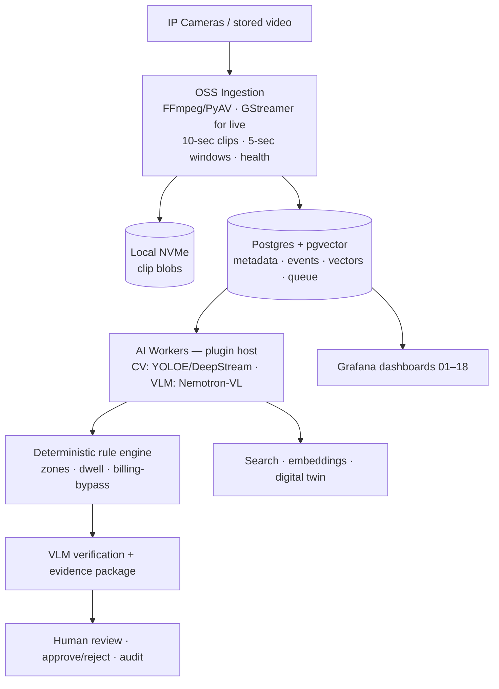
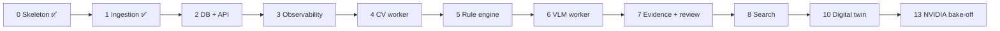

# Infographic brief — Kathirmani Video-AI Platform

Inputs for generating infographics with Claude / Canva / Figma / other AI design
tools. Everything here is grounded in **real repo data** (`results/*.json`) and the
spec (`spec/10`, `spec/11`). Rendered figures live in `design/figures/` — use them
as-is or as references for a redesign.

---

## 1. One-liner & audience

> **An OSS-ingestion-first, NVIDIA-model-first video intelligence platform for retail
> stores** — turns existing CCTV into time-grounded events, loss-prevention alerts,
> natural-language video search, and auditable evidence, all explainable in dashboards.

**Audiences:** (a) a store owner/operator (non-technical — "what does it do for my
shop, what does it cost"), (b) a technical/investor reader ("architecture, models,
efficiency"). Make two variants if needed.

## 2. Headline stats (real — one 5-camera analysis run)

| Stat | Value | Plain meaning |
|------|-------|---------------|
| Cameras analyzed | **5** | same store, 5 angles |
| Events detected | **9** → **8 unique** | after cross-camera dedup |
| Energy | **8.2 Wh** | for the whole run |
| Cost | **₹0.082** | to analyze all 5 cameras |
| Efficiency | **1.1 events/Wh** · **₹0.0091/event** | useful signal per unit energy/cost |
| GPU power | **~55 W avg** | on an NVIDIA DGX Spark GB10 |
| Wall time | **~9 min** | end to end |

> Pull-quote idea: **"Analyzing five security cameras cost about 8 paise of electricity."**

## 3. Key messages (the narrative)

1. **Uses the cameras you already have** — no new hardware on the shop floor.
2. **Cheapest-work-first cascade** — a light model finds *when/where*; the expensive
   vision-language model only looks at *suspicious* moments. "Do less work."
3. **Evidence, not just alerts** — every flag links to a clip + model explanation +
   human review (tamper-evident: checksums, audit trail).
4. **Free & open NVIDIA models** — Nemotron-VL, C-RADIO, Cosmos; swappable by config.
5. **Explainable** — Grafana dashboards a non-ML operator can read.
6. **Multi-store by design** — onboard a new store with YAML, not code.

## 4. Rendered assets (in `design/figures/`)

**Data figures** (matplotlib, from `results/*.json`; regenerate: `python design/make_figures.py`):

| File | Use for |
|------|---------|
| `cascade_flow.png` | the 3-stage WHEN→WHERE→WHAT cascade |
| `platform_architecture.png` | the full pipeline, left-to-right |
| `operator_one_pager.png` | a ready vertical one-pager (owner audience) |
| `events_per_camera.png` | per-camera activity bar chart |
| `efficiency_cards.png` | the cost/energy stat cards |
| `cross_camera_dedup.png` | 5 angles → one store-wide truth |

**Real Grafana dashboard screenshots** (server-side rendered PNGs; regenerate:
`bash scripts/render_dashboards.sh`):

| File | Dashboard |
|------|-----------|
| `dashboard_model_performance.png` | Model Performance & Usefulness (headline) |
| `dashboard_economy.png` | Compute economy / cost |
| `dashboard_cameras.png` | Per-camera views |
| `dashboard_fused.png` | Store-wide / fused |
| `dashboard_pipeline.png` | Model output quality |
| `dashboard_qwen.png` | Loss-prevention (Qwen) |

> The Grafana **image renderer** is now installed (a `renderer` sidecar +
> `GF_RENDERING_SERVER_URL` on Grafana). Live dashboard: `http://localhost:3000`
> (admin/admin) → **Marlin Inference › Model Performance & Usefulness**
> (`/d/marlin-model-perf`). Run `bash start_stack.sh` first if panels are empty.

## 5. Diagrams to render (Mermaid — paste into a Mermaid renderer or an AI tool)

### Platform architecture


### Phase roadmap


## 6. The NVIDIA model lineup (free / open, on HuggingFace)

| Job | Model |
|-----|-------|
| Vision-language (verify) | `nvidia/Llama-3.1-Nemotron-Nano-VL-8B-V1` |
| Reasoning / summaries | `nvidia/NVIDIA-Nemotron-3-Nano-30B-A3B` |
| Visual embedding / search | `nvidia/C-RADIOv4-H` |
| Physical / digital-twin reasoning | `nvidia/Cosmos-Reason2-2B` |
| Detection (interim, free) | YOLOE / RT-DETR |

## 7. Style

- **Palette:** NVIDIA green `#76B900` (accent), ink `#1A1A1A` (text), slate `#3B4252`,
  muted `#8A8F98`, off-white card `#F5F7F2`, white bg. Optional alert-red `#E5484D`.
- **Tone:** clean, technical-but-approachable, lots of white space, big numbers.
- **Iconography:** camera, shelf/cart, shield/lock (trust), bar chart, lightning (energy).

## 8. Ready-to-paste prompts for an AI design tool

> **A — Operator one-pager (vertical):** "Create a clean vertical infographic titled
> *'AI eyes on your store'* for a retail store owner. Use NVIDIA green (#76B900) on
> white. Sections: (1) 5 CCTV cameras → AI, (2) what it finds: time-stamped events,
> suspicious-item alerts, billing-bypass, (3) big stat cards: *₹0.082 to analyze 5
> cameras*, *8.2 Wh energy*, *~9 min*, (4) 'Evidence, not just alerts — every flag has
> a clip + human review'. Friendly icons, minimal text."

> **B — Technical architecture poster (landscape):** "Create a landscape architecture
> infographic for *'Kathirmani Video-AI Platform'*. Show the pipeline left-to-right:
> Cameras → OSS Ingestion (10-sec clips, 5-sec windows) → Postgres+filesystem → AI
> workers (NVIDIA Nemotron-VL / YOLOE) → rule engine → evidence + human review →
> Grafana. Side panel: 'Free NVIDIA models, swappable by config'. Use the palette in
> §7. Base it on the Mermaid diagram in §5."

> **C — The cascade explainer:** "Make a 3-step infographic of a 'cheapest-gate-first'
> AI cascade: Step 1 WHEN (Marlin-2B, time-grounded events), Step 2 WHERE (YOLOE,
> objects + a cheap gate), Step 3 WHAT (Nemotron-VL, only on suspicious moments).
> Emphasize 'the expensive model only runs when needed — do less work'. Green accent."

> **D — Efficiency / TCO card set:** "Design 6 stat cards from these numbers: 8.2
> watt-hours, ₹0.082 cost, 1.1 events/Wh, ₹0.0091 per event, 55 W avg GPU, 9 min. Title
> *'Cost & efficiency — one 5-camera run'*. Rounded cards, NVIDIA-green borders."

> Attach the matching PNG from `design/figures/` to any prompt as a visual reference.

---

## AI image generation (Nano Banana + gpt-image-1)

`design/ai_images.py` turns these prompts into images via **Google "Nano Banana"**
(`gemini-2.5-flash-image`) and **OpenAI** (`gpt-image-1`). This is *design-time tooling
only* — it does **not** touch the production NVIDIA-only inference pipeline (spec/11).

```bash
make setup-design                                    # installs google-genai + openai + pillow
# keys via env / .env only (spec/10): GEMINI_API_KEY / OPENAI_API_KEY
make gen-image PROVIDER=both PROMPT="$(cat <<<'C — the cascade explainer …')" OUT=cascade
# editing/fusion: feed an existing figure as a reference (Nano Banana excels at this)
python design/ai_images.py --provider gemini --ref design/figures/platform_architecture.png \
    --prompt "redraw as a glossy 3D isometric infographic, keep the labels" --out arch_iso
```

Outputs land in `design/figures/generated/<out>__<provider>.png` (gitignored — regenerable).
